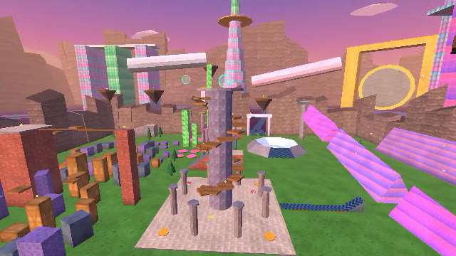
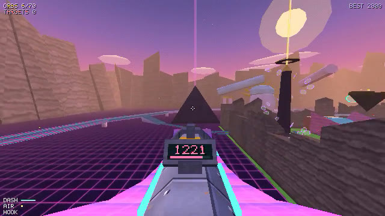

# AFTERGLOW PARK

A chill PS1-style movement playground. No enemies, no timer: bunnyhop, slide, wallrun, surf,
grapple and rocket-jump around a sunset park and collect golden orbs if you feel like it.
It runs entirely in the browser.

**[Play it](https://maximumskull.com/games/afterglow-park/)** (keyboard and mouse).



## Run

```bash
npm install
npm start
```

Then open http://localhost:5317 and click **CLICK TO PLAY**. The mouse gets captured and the game goes
fullscreen (that can be turned off in the menu); Esc releases both.

## Static build

Everything is client-side: there is no server code, and all textures, music and sound effects are
generated in the browser. To host it anywhere (a blog, GitHub Pages, any static file host):

```bash
npm run build
```

This bundles the game, three.js included, into `dist/`: `index.html`, `style.css` and a minified
`game.js` (about 660 KB, 190 KB gzipped). Upload those three files. The trailer recorder, the only
code that talks to a server, is left out of this build.

## Controls

| Key | Action |
| --- | --- |
| WASD | move |
| Space | jump: hold to bunnyhop, tap in the air to double jump (also mouse wheel) |
| Shift / C | crouch: slide when moving fast; crouch in the air to tuck your legs |
| E / F (or middle mouse) | dash |
| Right mouse / Q (hold) | grappling hook |
| Left mouse | pulse rocket: shoot your feet to rocket jump |
| R (hold 3 s) | back to spawn |
| M | music on/off |
| ` or F3 | debug overlay |

## The park

- **Plaza + spire** (spawn): climb the spiral ledges (jump + mantle) to the top orb.
- **North: wallrun gauntlet**: alternating walls over a gap. Wallrun, wall-jump, repeat.
- **East: surf ramps**: drop from the start platform onto the pink ramps and hold A/D into the ramp.
- **South: slide mountain**: slide down for speed, hit the boost ring and kicker at the bottom.
- **West: parkour blocks + brick tower**, with stepping stones and a balance beam.
- **Sky islands** everywhere, reachable with the hook.
- **North-east: ice bowl**: a crater of frictionless ice; the glowing south face flings you in.
- **North-west: trampoline yard**: trampolines (hold Space to pump higher, crouch to land), a
  pinball alley of bouncy walls, goo pillars, and a goo "beanstalk" up to a sky island.
- **East runway**: a speed strip + kicker that throws you over the surf line onto the far quarter pipe.
- **South-east: THE OBELISK**: a floating monolith in a low-gravity field. Crawl its sticky faces or
  ride the Obelisk Express (a spiral of homing rings) to the golden halo. Reaching the summit awakens it.
- **Beyond the wall: the megacity**, a ring of oversized vaporwave megastructures all around the park.
  Each side of the park wall has a greek gateway and a canyon with speed lanes (out and back), plus a
  launch pad at each gate. The music goes "slowed + reverb" out there.
  - **The Vaporway**: a raised ring highway with 2400 u/s speed strips, rails, giant arches and ramps
    (speed roads lead from the north, east and south gates to its ramps).
  - **N, the supertall**: ride the Sky Elevator (feeder strip + homing rings) to the sky deck, then crawl
    the green glass crown to the very top.
  - **NW**: three glass towers with a sky-ship deck and an infinity pool (the green middle tower is crawlable).
  - **NE**: the golden frame. Fly through its ring and it throws you onto the supertall's sky deck.
  - **E, the Sail**: a 3600-high curved ice drop. The runout's kicker flings you onto the pyramid.
  - **SE**: a black glass pyramid to surf, with its own sky beam.
  - **S**: a buried colossal Helios head with a golden crown of rays.
  - **SW, the Palm**: a palm island of skateable ice inside a wallrun crescent.
  - **W, the acropolis**: neon-grid plateau with a skateable glass pool, arches with boost rings,
    wallrun stoas, a tholos, a Parthenon with a walkable roof and a giant Helios bust.
  - The west gate's launch pad throws you all the way onto the supertall's sky deck.
  - **Far west, beyond the Vaporway: the Mega-Parthenon**. A giant Parthenon (3600 x 8100 stylobate,
    46 columns 1200 tall, gold capitals, a neon frieze, pediments, open roof beams) with a gold-and-ivory
    Athena Parthenos inside, a two-tier colonnade with walkable beams and a skateable reflecting pool.
    Walk there from the acropolis (under the highway) or take the launch pad behind the acropolis.
- Orange pads launch you between zones.

## Parkour routes

Untimed, just for fun:

- **The Peristyle Climb** (Mega-Parthenon, outside): from the top of the east ramp, climb the floating
  stones up the east colonnade, run the entablature north and up the pediment to its apex.
- **The Naos Run** (Mega-Parthenon, inside): from the north door, climb the floating blocks onto the
  colonnade beams, go round to the south beam, then up the stepping slabs to Athena's helmet crest.

Every jump of both routes is checked by a bot in the tests.

## Surfaces

Everything is plain ground/wall/surf by steepness, plus four physics materials:

| Surface | Looks like | Does |
| --- | --- | --- |
| Ice | pale blue | almost no grip; slopes pull you downhill |
| Bounce | pink polka dots | reflects you; hold Space to pump higher, crouch to land |
| Speed strip | glowing chevrons | pushes you along the arrows, no friction |
| Goo | green slime / green glass | wall-crawl: W moves where you look, let go to hang, jump to kick off |

## How it's built

- `src/player.js`: Quake 3 / Source style movement (accel, friction, air strafing, slide-move
  collision with stair stepping) plus slide, wallrun, wall jump, double jump, dash, mantle and grapple.
- `src/collision.js` + `src/brush.js`: convex brushes and swept-box traces (port of Q3's box-vs-brush clip, with exact bevel planes).
- `src/sim.js`: fixed 125 Hz deterministic simulation (rockets, pads, rings, orbs). No DOM, so it runs in Node.
- `src/render/`: three.js with custom PS1 shaders: low-res render target (360p by default), vertex snapping (wobble), affine texture
  mapping (faded to perspective-correct right next to the camera so close-up floors don't smear), Gouraud lighting, fog, and a 15-bit ordered-dither upscale pass. All textures are generated procedurally.
- `src/audio.js`: all sound synthesized with WebAudio, including a generative ambient soundtrack.



## Performance

- Press <kbd>`</kbd> (or F3) in game for a live overlay: FPS, frame time (avg + p95), CPU time per
  phase (sim / render submit / HUD), GPU time when the browser exposes timer queries, triangles and
  draw calls.
- Open http://localhost:5317/?bench for a repeatable fly-through of every zone. Each frame waits for the
  GPU to finish, so it reports the real cost of a frame (and fps headroom at p95) rather than being
  capped by the display refresh rate. Results also go to the console as JSON (`AFTERGLOW BENCH ...`).
  Run it in a visible, focused tab: background tabs get throttled and report garbage.
- The world mesh is chunked into 2560-unit tiles so off-screen chunks are frustum-culled, faces nobody
  can see (underground, backs of the outer mountains) are skipped, and the HUD font draws from a glyph atlas.
- Megastructures use perspective-correct "mega" materials with coarse mesh cells, so they stay cheap.
- Anti-flicker: textures are mipmapped (nearest up close, filtered far away), the vertex wobble fades out
  with distance, and translucent effects use real blending instead of dither patterns.
- Sound pauses whenever the tab is hidden or loses focus.

## Trailer

`npm run trailer`, then open http://localhost:5318/?trailer. Bots play the shot list in
`src/trailer-shots.js` frame by frame (fixed game time, so it can't stutter), the soundtrack is
rendered offline with the game's own synth, and ffmpeg writes `trailer.mp4` to the project root.

## Tests

```bash
npm test
```

Headless physics tests: traces, stairs, slopes, bhop speed gain, surfing, slides, wallruns, double jump,
dash, mantle, grapple, rocket jump, all four surface materials, every jump pad landing on its target,
bot runs through the zones (all 16 Obelisk Express rings to the summit, crawling the obelisk, the
beanstalk, the runway, the ice bowl), and a 4-minute random-input fuzz run that checks the player
never ends up inside geometry.

Debug URL flags: `?autostart` (skip the menu), `?nolock` (no pointer lock or fullscreen), `?timerloop` (drive frames
with timers so hidden tabs keep simulating), `?res=480`, `?bench` (benchmark). In the console, `game.bot(policy)` runs a
reactive input policy against the real game, and `game.teleport(x, y, z, yaw)` moves you around.
